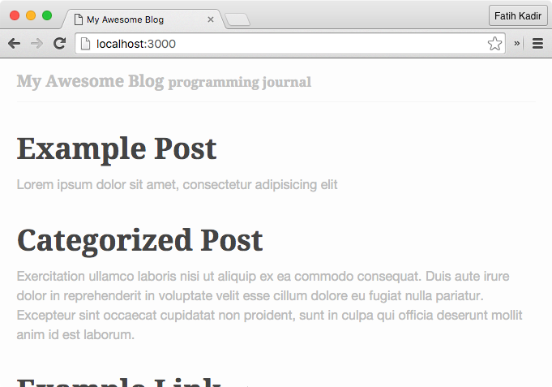
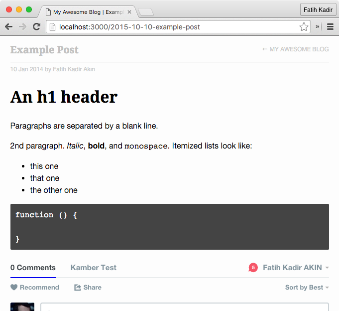

# Kamber


Kamber is a blog server based on [Kemal](http://github.com/sdogruyol/kemal).

> This is not a static blog generator, **it's a static blog server**. It _doesn't require_ any other HTTP servers. It uses Crystal and Kemal to generate HTML and also serve it.

## Features

- Supports many post types:
  - **Markdown** Posts
  - GitHub **Gist**
  - **Tweet** Embeds
  - **Video** Embeds
  - Disqus Comments
- **Very fast**, since it's based on [Kemal](http://github.com/sdogruyol/kemal).
- Easy to develop. Just add contents to **`posts.yml`** file.

## Getting Started

- [Fork](https://github.com/f/kamber/fork) this repository.
- Edit `posts/posts.yml` file and add some content.
- Edit `kamber/config.cr` and set your title.
- `crystal build --release src/kamber.cr && ./kamber`

## `config.cr`

You can set your blog title from `config.cr`

```crystal
$BLOG_TITLE = "My Awesome Blog"
$BLOG_DESC = "programming journal"
$GOOGLE_ANALYTICS = "UA-XXXXX-X"
```

## Post Types

`posts/posts.yml` has multiple YAML documents, each represents a blog item (aka post type).

### Post (Markdown)

```yml
type: post
title: Example Post
abstract: Lorem ipsum dolor sit amet, consectetur adipisicing elit
file: posts/example-post.md
disqus: true
```

### Link

```yml
type: link
title: Example Link
url: "http://crystal-lang.org"
```

### Video

Kamber supports **Youtube** and **Vimeo** videos. The main pattern of `video` is
`[video provider]/[video id]`

```yml
type: video
title: Example Video
abstract:
video: youtube/YE3GkCB3t_0
```

If you will use **Vimeo**, change `video` key to

```yml
video: vimeo/147842467
```

### Tweet

This type embeds Tweets to the index. The pattern is `[username]/[tweet id]`

```yml
type: tweet
title: Example Tweet
tweet: fkadev/673506301415194625
```

### Gist

This type embeds GitHub Gists to the index. The pattern is `[username]/[gist id]`

```yml
type: gist
title: Example Gist
gist: f/c12af6b9e7d53bd9224d
```

## Screenshots





## Contributing

1. Fork it ( https://github.com/f/kamber/fork )
2. Create your feature branch (git checkout -b my-new-feature)
3. Commit your changes (git commit -am 'Add some feature')
4. Push to the branch (git push origin my-new-feature)
5. Create a new Pull Request

## Roadmap

- [x] Add base post types and make it run
- [ ] Add page support

## Contributors

- [f](https://github.com/f) Fatih Kadir Akın - creator, maintainer
